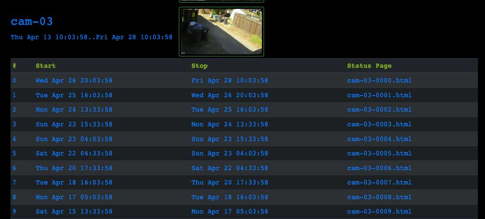

# PANOPTICON

A home-brewed, non-cloud-based camera surveillance system.

I built my own camera surveillance system. I started in late December 2017, and  plugged away at it for the next two years after the kids were in bed.

## System Requirements

My high-level requirements are simple:

- My system needs to provide continuous surveillance of the front and
  back of my house from multiple viewpoints; at least 5 cameras.
- In the event that something happens, I need to be able to easily
  review footage from at least two weeks ago.
- The footage needs to be of sufficient quality to identify a face
  from a reasonable distance (at the edges of my property).
- Image and video storage should be local--not in the cloud.

A long time ago, I cobbled together a toy system consisting of a single camera (analog! I had to use a video card to capture the signal), Windows + bash scripts. I captured nice images of critters in my yard, and I learned a few things:

- Resolution is king; 1080p is a minimum useful resolution; at lower resolution, faces at any distance appear as mere blurs.
- The video frame rate needs to be at least 15 FPS.
- It's important to have good connectivity, via wifi or cable: the combination of spotty coverage (at the corners of my property) and high-bandwdith content will cripple a surveillance system.
- Motion detection mostly doesn't work: traditional (non-NN) motion detection algorithms simply threshold the sum of differences between frames. This works fine against a static background, but add a tree, shadows, a bit of breeze, and presto! you've got motion and false detects.
- Motion detection is really important:  I don't want to search (or even store) two weeks of continuous footage to find a particular event, so having motion detection as a first-pass filter is critical.
- The system needs a UI which lets me quickly review several weeks of footage across multiple cameras.
- Live video ain't important. Being able to watch in real-time is necessary for camera installation and debugging, but unless you're a security guard,  it's not necessary.

## Camera Requirements

There are tons of cameras out there, but it wasn't hard to narrow down my choices.

Firstly, I wanted to surveil my entire home, so a single computer needs to service N cameras. This precludes USB. The cameras need to support an ethernet connection--wired ethernet might work in some cases, but probably wifi.

These cameras are going outside, so the housings need to be rated for outdoor use.

"Night vision" is a nice-to-have, but I was prepared to install separate illumination if necessary.

This still left a plethora of "home security" products like the Ring camera, which require an always-on internet connection. At the time, I had a DSL connection which supported a paltry 1 Mbps upstream--barely sufficient for a single camera. Since I wanted multiple cameras, this wasn't an option. Also, I'm a cheap bastard who only wants to pay for stuff that I can't do myself, thus I wanted all media stored on my local machine.

Finally, there is the issue of subjecting yourself to the whims of the manufacturer. Obviously, cloud-based cameras require the company to continue running a server for their cameras; when it's no longer worth their while, the services go off-line. Once upon a time, a startup called Revolv sold a home "Smart Hub" which did some useful stuff. People bought it. Unfortunately, the smart hub required a back-end server to operate. In 2014 Google bought Revolv for buckets of cash. Two years later, Google decided to shut down the Revolv server. Revolv users were left with an expensive paperweight.

Consider an even simpler case: even a non-cloud connected camera may require firmware upgrades and driver updates. I didn't want to be left with a useless camera after a browser update.

The upshot is that I'd prefer a camera which doesn't require any service or support from the manufacturer.

To summarize the camera requirements:

* doesn't require cloud service of any kind

* minimal post-purchase support requirements

* wifi connectivity

* at least 1080p resolution

* video frame rate at least 15 FPS

In the end, I settled on the Amcrest  "bullet" IP cameras: the IP2M-842 and its successor, the IP3M-943. Not perfect, but it checked most of my boxes.


For mounting, I found a 3D-printable mount on [Thingiverse](https://www.thingiverse.com/thing:2022254/files) , which made installing the cameras outside a bit easier.


## My Home Network

The cameras upload images and video to a server via FTP (they also stream live video, but that's not important for me). From playing around with the cameras, I knew that good connectivity was important; the Amcrest firmware tends to give up too easily when uploading. I spent a fair amount of time getting my home wifi in sufficient shape to handle connectivity from all points on my property (and I don't have a large lot). 

## The Server

The Pano software is straightforward:

* when triggered by a motion event, the cameras upload images and video to an FTP server

* my software periodically wakes up, looks for new media, indexes the media in a SQLite database, culls expired media, and generates static webpages with image thumbnails

* a webserver serves up the webpages

```
                       +-------------+
   +----------+        |             |
   |          |        |             |
   |  camera  |------->|  FTP server |
   +----------+        |             |
                       +-------------+
                             |
                             |
                             |                                   +------------+
                             v                                   |            |
                         ==========          ============        |  webserver |
                         storage          |^ HTML pages  ------->|            |
                         ==========       /  ============        |            |
                             |           /                       +------------+
                             |          /
                             |        _/
                             v        /
                       +----------------+
                       |                |
                       | Index media    |
                       | generate pages |
                       |                |
                       +----------------+
```

# 

Pano runs on my desktop Linux PC. The server hardware doesn't need to be particularly beefy, because it is not doing any intensive processing besides generating image thumbnails--again, motion detection is handled by the cameras. 

The status pages are static because I don't enjoy tweaking HTML or writing Javascript.

## Output

The top-level page lists cameras and a thumbnail.


Each camera has an individual page, which lists time periods of recorded activity.




Air squirrel!


A nocturnal gentleman filching my childrens' shoes

![59[M][0@0][0].jpg](./readme-images/59[M][0@0][0].jpg)


# pano-docker

As an exercise to learn Docker, I deployed the server components as Docker containers.

pano + vsftpd + lighttpd

To build and run the three dockers, run the script

> docker-compose-up.sh

```
(base) ryu@chuyu-server:pano-dev$ docker ps
CONTAINER ID   IMAGE               COMMAND                  CREATED          STATUS          PORTS                                                              NAMES
420fc2a26bd5   pano-dev_vsftpd     "/start.sh"              13 minutes ago   Up 13 minutes   0.0.0.0:21->21/tcp, 20/tcp, 0.0.0.0:21100-21110->21100-21110/tcp   pano-dev_vsftpd_1
2708f86ae031   pano-dev_pano       "./start-pano-docker…"   13 minutes ago   Up 13 minutes                                                                      pano-dev_pano_1
a5a52ee44230   pano-dev_lighttpd   "start.sh"               13 minutes ago   Up 13 minutes   0.0.0.0:8080->80/tcp                                               pano-dev_lighttpd_1
```

To monitor pano (other dockers write logs to the same directory)

> tail -F /mnt/HD2/pano/logs/pano.log 

To bring things down:

> docker-compose down

# Manually starting dockers

The scripts start-dockers.sh, stop-dockers.sh, stop-start-dockers.sh are for starting the dockers "manually," without docker-compose. They're used when developing and testing.

# Project Log

https://docs.google.com/document/d/1UDShbouFjIxBU0mpFkE1or6D4iOpjN0G8gaLTpkIcR4/edit?usp=sharing

```
https://buttersquid.ink/?spore=bNobwRALmBcYE4FMDGUA0YAeMDM6CeMA7OgO4wCM56AF
jugGZIxgAEYD9MADOgDYD2WaAFpcYAQWg9IvGOF5RYSAIYBbBHGXtxANwoBffanCL4yNJhgAmMZ
IBspCgBYaMAKwMmsNh259BMMIu4vyS0hCy0PKmAGIAKgAKLADOGjoa2rx60OSGxpDMvACWAHYI2
hjk1gCc6BhWNfhVOVb4DTkeYAhaUugIAEYU-kKtIWHoEXLipgA6AK5ci1V82Vx5JswQ-QF11sGS
5J0QGKYAvOcXlzMlyRD8mgDmCNeXr6fa2fTKvKlGG7DFMoVZqHOrtKyjPDNWpgPDtGHdPxdQY5Y
ZDMZIyZRabMeaLLjLXTcdYFWCIFAVay2KmOHLEMC0aCdRjMHxgeicXohITCekSQJUGRTBTMACSJ
QAJggMCx1BKisprk8ypoIAgWAAHZRPZLXTLZXJ-UniUrlOrNKww+qNWEgmFw6yjRFcgbogQjfzj
IXYkWwPFLfXEo2mckWIR2ToHYJkHJiRnMrysbQcpHuwLBfkiQVY6LMEgDVJwdJwQM5EmmLY7SzQ
Jz7ChHE7MN5va4ACTiAFkADKa7UIXUlZuvD4wL4-BDBwqm4EwJxia3QbAADiaFHpDugEL6PUFrq
5ac3nsxkVzfoWAZWQfypkBZswzTc9IXdn2IPX7XI9Od0j3goPf9CY9hVmc8CVLNZ9AAXSAA
```
