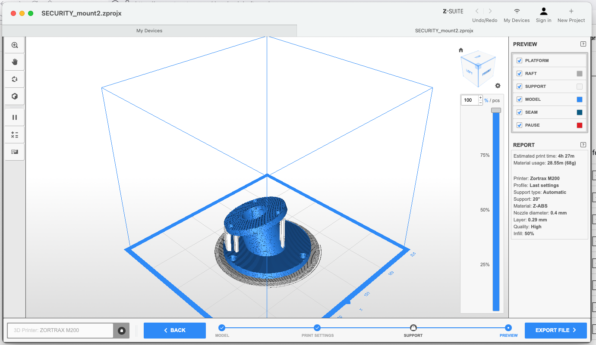

# 3d-Printed Camera Mount for Amcrest Cameras

2022.04.14

Original file downloaded from https://www.thingiverse.com/thing:2022254

Tutorial on converting .stl to Zortrax-compatible file:

https://art.illinois.edu/about/resources-for-current-students/facilities/digital-labs/tutorials-templates/tutorial-preparing-3d-print-files-for-the-zortrax-printers/

Need to print in ABS plastic (for outdoor use) on the Zortrax

I downloaded the latest ZSuite software from https://support.zortrax.com/downloads/software/ and opened SECURITY_mount2.zprojx: 

So I should be able take SECURITY_mount2.zcode to the Zortrax to print.

